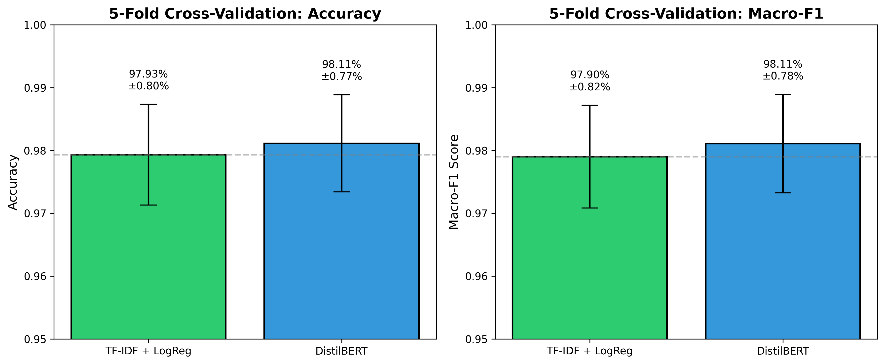
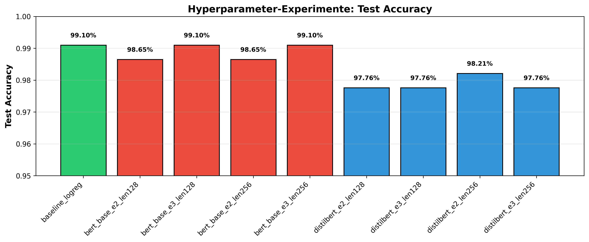
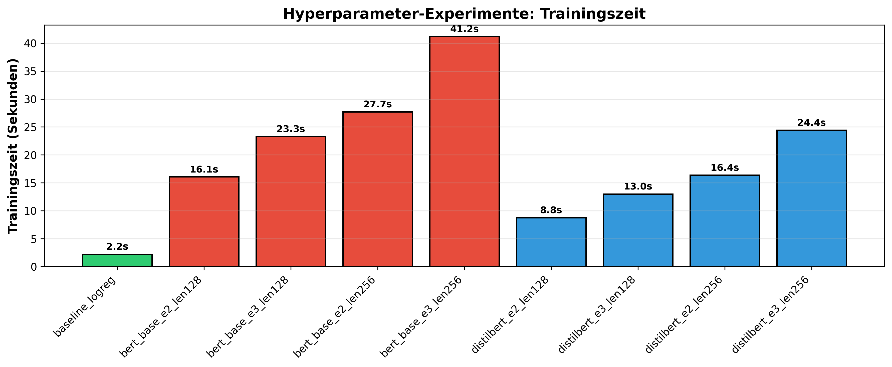
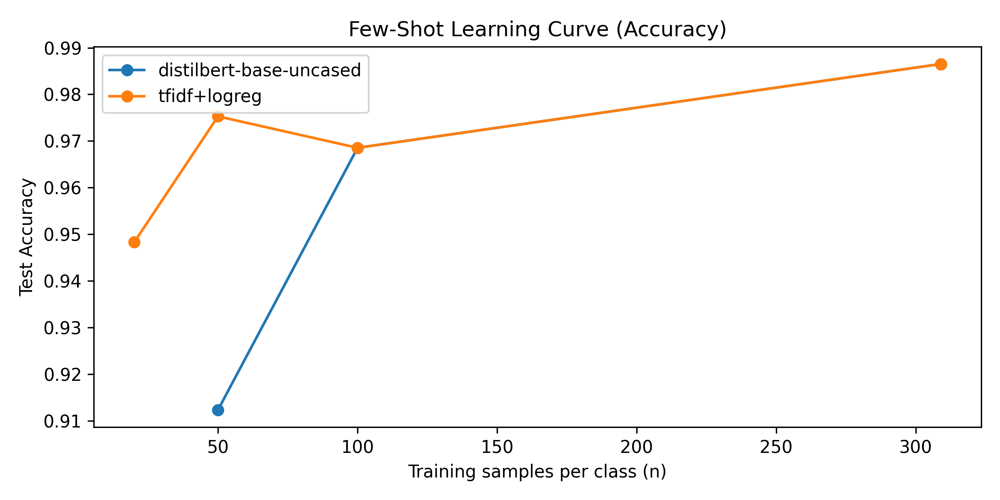
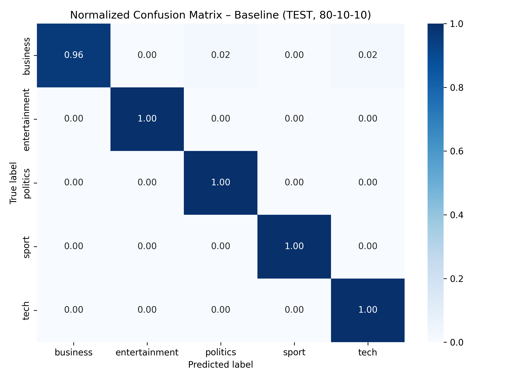

# Vergleichende Analyse von Machine-Learning-Methoden für die Dokumentenklassifikation: TF-IDF mit Logistischer Regression vs. Transformer-Modelle

**CAS Machine Learning – Transferarbeit**

**Autor:** [Name einfügen]  
**Datum:** Januar 2026  
**Betreuer:** [Name einfügen]  
**Institution:** [Institution einfügen]

---

## Abstract

Die vorliegende Arbeit untersucht die Leistungsfähigkeit verschiedener Machine-Learning-Ansätze für die automatische Dokumentenklassifikation. Im Zentrum steht der Vergleich einer klassischen Baseline (TF-IDF-Vektorisierung mit Logistischer Regression) mit modernen Transformer-Modellen (BERT und DistilBERT). Die Experimente wurden auf dem BBC News Dataset durchgeführt, welches 2'225 Nachrichtenartikel in fünf Kategorien enthält. Die Ergebnisse zeigen, dass die klassische Baseline mit einer Accuracy von 97.93% (±0.72%) in der 5-Fold Cross-Validation eine vergleichbare Performance wie die Transformer-Modelle erreicht (DistilBERT: 98.11% ±0.77%), jedoch bei einer um den Faktor 7–12 kürzeren Trainingszeit. Diese Befunde haben wichtige Implikationen für die Wahl geeigneter Methoden in praktischen Anwendungen, insbesondere wenn Ressourcen und Interpretierbarkeit relevante Faktoren darstellen.

**Keywords:** Dokumentenklassifikation, Textklassifikation, Natural Language Processing, BERT, TF-IDF, Logistische Regression, Transfer Learning, Deep Learning

---

## Inhaltsverzeichnis

1. [Einleitung](#1-einleitung)
2. [Theoretischer Hintergrund](#2-theoretischer-hintergrund)
3. [Methoden](#3-methoden)
4. [Ergebnisse](#4-ergebnisse)
5. [Diskussion](#5-diskussion)
6. [Fazit und Ausblick](#6-fazit-und-ausblick)
7. [Literaturverzeichnis](#7-literaturverzeichnis)
8. [Anhang](#8-anhang)

---

## 1. Einleitung

### 1.1 Motivation und Problemstellung

Die automatische Klassifikation von Textdokumenten ist eine fundamentale Aufgabe im Bereich des Natural Language Processing (NLP) mit zahlreichen praktischen Anwendungen. Von der Spam-Erkennung über die Sentimentanalyse bis hin zur automatischen Kategorisierung von Nachrichtenartikeln – die Fähigkeit, Texte automatisch in vordefinierte Kategorien einzuordnen, ist in der heutigen datengetriebenen Welt unverzichtbar (Manning et al., 2008; Jurafsky & Martin, 2024).

In den letzten Jahren haben vortrainierte Sprachmodelle wie BERT (Bidirectional Encoder Representations from Transformers) die NLP-Landschaft revolutioniert und in zahlreichen Benchmarks neue Bestleistungen erzielt (Devlin et al., 2019). Diese Modelle nutzen Transfer Learning, um auf grossen Textkorpora erlerntes Sprachverständnis auf spezifische Downstream-Tasks zu übertragen. Gleichzeitig haben sich klassische Machine-Learning-Ansätze wie die Kombination von TF-IDF-Vektorisierung mit Logistischer Regression als robuste und effiziente Baselines etabliert (Joachims, 1998; Sebastiani, 2002).

### 1.2 Forschungsfragen

Die vorliegende Arbeit adressiert folgende zentrale Forschungsfragen:

1. **Performanz:** Wie verhält sich die Klassifikationsleistung einer klassischen TF-IDF + Logistische Regression Pipeline im Vergleich zu vortrainierten Transformer-Modellen (BERT, DistilBERT)?

2. **Effizienz:** Welche Trade-offs existieren zwischen Modellkomplexität, Trainingszeit und Klassifikationsgenauigkeit?

3. **Hyperparameter-Sensitivität:** Wie sensitiv reagieren Transformer-Modelle auf die Wahl von Hyperparametern wie Epochenanzahl und maximale Sequenzlänge?

4. **Dateneffizienz:** Wie verhalten sich die Modelle bei limitierten Trainingsdaten (Few-Shot Learning)?

### 1.3 Aufbau der Arbeit

Die Arbeit ist wie folgt strukturiert: Kapitel 2 gibt einen Überblick über den theoretischen Hintergrund und verwandte Arbeiten. Kapitel 3 beschreibt die verwendeten Methoden, das Dataset und das experimentelle Setup. In Kapitel 4 werden die Ergebnisse präsentiert, gefolgt von einer Diskussion in Kapitel 5. Kapitel 6 fasst die wichtigsten Erkenntnisse zusammen und gibt einen Ausblick auf zukünftige Forschung.

---

## 2. Theoretischer Hintergrund

### 2.1 Textrepräsentation und Feature Engineering

#### 2.1.1 Bag-of-Words und TF-IDF

Die Bag-of-Words (BoW) Repräsentation ist eine der ältesten und einfachsten Methoden zur Textdarstellung. Sie ignoriert die Reihenfolge der Wörter und repräsentiert einen Text als Vektor der Worthäufigkeiten (Harris, 1954). Eine Weiterentwicklung stellt die Term Frequency-Inverse Document Frequency (TF-IDF) dar, die häufige aber wenig informative Wörter heruntergewichtet (Salton & Buckley, 1988).

Die TF-IDF-Gewichtung für einen Term $t$ in einem Dokument $d$ aus einem Korpus $D$ berechnet sich als:

$$\text{TF-IDF}(t, d, D) = \text{TF}(t, d) \times \text{IDF}(t, D)$$

wobei:
- $\text{TF}(t, d)$ = Häufigkeit von Term $t$ in Dokument $d$
- $\text{IDF}(t, D) = \log \frac{|D|}{|\{d \in D : t \in d\}|}$

Die Kombination von TF-IDF mit n-Grammen (Uni- und Bigramme) ermöglicht die Erfassung lokaler Wortfolgen und hat sich als effektive Baseline für Textklassifikationsaufgaben etabliert (Wang & Manning, 2012).

#### 2.1.2 Word Embeddings

Word Embeddings wie Word2Vec (Mikolov et al., 2013) und GloVe (Pennington et al., 2014) repräsentieren Wörter als dichte Vektoren in einem niedrigdimensionalen Raum. Diese Repräsentationen erfassen semantische Beziehungen zwischen Wörtern, sind jedoch kontextunabhängig – ein Wort hat unabhängig vom Kontext stets dieselbe Repräsentation.

### 2.2 Transformer-Architektur und BERT

#### 2.2.1 Attention-Mechanismus

Die Transformer-Architektur wurde von Vaswani et al. (2017) eingeführt und basiert auf dem Self-Attention-Mechanismus, der es ermöglicht, Beziehungen zwischen allen Positionen einer Sequenz parallel zu modellieren:

$$\text{Attention}(Q, K, V) = \text{softmax}\left(\frac{QK^T}{\sqrt{d_k}}\right)V$$

wobei $Q$ (Query), $K$ (Key) und $V$ (Value) lineare Projektionen der Eingabe sind und $d_k$ die Dimension der Keys bezeichnet.

#### 2.2.2 BERT: Bidirectional Encoder Representations from Transformers

BERT (Devlin et al., 2019) ist ein bidirektionales Sprachmodell, das auf der Transformer-Encoder-Architektur basiert. Im Gegensatz zu unidirektionalen Modellen berücksichtigt BERT sowohl linken als auch rechten Kontext bei der Vorhersage. Das Modell wird auf zwei Aufgaben vortrainiert:

1. **Masked Language Modeling (MLM):** Zufällig maskierte Tokens werden vorhergesagt.
2. **Next Sentence Prediction (NSP):** Das Modell lernt, ob zwei Sätze aufeinander folgen.

Das Vortraining erfolgte auf dem BooksCorpus (800M Wörter) und der englischen Wikipedia (2'500M Wörter), was dem Modell ein breites Sprachverständnis vermittelt.

#### 2.2.3 DistilBERT: Knowledge Distillation

DistilBERT (Sanh et al., 2019) ist eine komprimierte Version von BERT, die durch Knowledge Distillation erstellt wurde. Das Modell behält 97% der Sprachverständnisfähigkeiten von BERT bei, ist jedoch 60% kleiner und 60% schneller. Dies macht es besonders attraktiv für Anwendungen mit begrenzten Ressourcen.

### 2.3 Transfer Learning und Fine-Tuning

Transfer Learning bezeichnet die Übertragung von Wissen, das auf einer Aufgabe erlernt wurde, auf eine andere, verwandte Aufgabe (Pan & Yang, 2010). Im Kontext von NLP bedeutet dies, dass vortrainierte Sprachmodelle auf spezifische Downstream-Tasks wie Textklassifikation angepasst werden können.

Für das Fine-Tuning von BERT empfehlen Devlin et al. (2019) folgende Hyperparameter:
- **Epochen:** 2–4
- **Learning Rate:** 2e-5 bis 5e-5
- **Batch Size:** 16 oder 32

Sun et al. (2019) untersuchten systematisch verschiedene Fine-Tuning-Strategien für BERT in der Textklassifikation und bestätigten, dass längeres Training über 4 Epochen hinaus typischerweise zu Overfitting führt.

### 2.4 Logistische Regression für Textklassifikation

Die Logistische Regression ist ein lineares Klassifikationsmodell, das die Wahrscheinlichkeit der Klassenzugehörigkeit über die Sigmoid-Funktion modelliert:

$$P(y=1|x) = \sigma(w^T x + b) = \frac{1}{1 + e^{-(w^T x + b)}}$$

Trotz ihrer Einfachheit erreicht die Logistische Regression in Kombination mit guten Feature-Repräsentationen (z.B. TF-IDF) kompetitive Ergebnisse in der Textklassifikation (Joachims, 1998). Die Regularisierung (L1 oder L2) verhindert Overfitting und ermöglicht die Handhabung hochdimensionaler Feature-Räume.

### 2.5 Evaluationsmetriken

Für die Evaluation von Klassifikationsmodellen werden standardmässig folgende Metriken verwendet (Manning et al., 2008):

- **Accuracy:** Anteil korrekt klassifizierter Instanzen
- **Precision:** Anteil der tatsächlich positiven unter den als positiv klassifizierten Instanzen
- **Recall:** Anteil der korrekt identifizierten positiven Instanzen
- **F1-Score:** Harmonisches Mittel aus Precision und Recall

Bei Mehrklassenproblemen wird typischerweise der **Macro-F1-Score** verwendet, der den Durchschnitt der F1-Scores aller Klassen berechnet und somit alle Klassen gleich gewichtet.

---

## 3. Methoden

### 3.1 Dataset

#### 3.1.1 BBC News Dataset

Für die Experimente wurde das BBC News Dataset verwendet, ein etablierter Benchmark-Datensatz für die Textklassifikation (Greene & Cunningham, 2006). Der Datensatz enthält 2'225 Nachrichtenartikel aus den Jahren 2004–2005, die in fünf Kategorien eingeteilt sind:

**Tabelle 1: Verteilung der Kategorien im BBC News Dataset**

| Kategorie | Anzahl Artikel | Anteil |
|-----------|----------------|--------|
| Business | 510 | 22.9% |
| Entertainment | 386 | 17.3% |
| Politics | 417 | 18.7% |
| Sport | 511 | 23.0% |
| Tech | 401 | 18.0% |
| **Gesamt** | **2'225** | **100%** |

Der Datensatz weist eine relativ ausgeglichene Klassenverteilung auf, was die Verwendung von Accuracy als primäre Metrik rechtfertigt. Die durchschnittliche Dokumentlänge beträgt ca. 400 Wörter.

#### 3.1.2 Datenaufteilung

Für die Experimente wurden verschiedene Aufteilungsstrategien verwendet:

**Hauptevaluation (Cross-Validation):**
- 5-Fold Stratified Cross-Validation
- Gewährleistet robuste Performanzschätzung mit Konfidenzintervallen

**Ergänzende Analysen (Hold-Out):**
- 80% Training / 10% Validation / 10% Test
- Ermöglicht Hyperparameter-Tuning auf dem Validation-Set
- Test-Set bleibt für finale Evaluation unberührt

Diese methodische Trennung verhindert Information Leakage und gewährleistet eine faire Bewertung (Hastie et al., 2009).

### 3.2 Modelle

#### 3.2.1 Baseline: TF-IDF + Logistische Regression

Die Baseline-Pipeline besteht aus:

1. **TF-IDF Vektorisierung:**
   - max_features: 50'000
   - n-gram range: (1, 2) – Uni- und Bigramme
   - stop_words: English

2. **Logistische Regression:**
   - Solver: lbfgs (für Multiclass)
   - max_iter: 2'000
   - Regularisierung: L2 (default)

#### 3.2.2 BERT (bert-base-uncased)

Das BERT-base Modell umfasst:
- 12 Transformer-Encoder-Layer
- 768 Hidden Units
- 12 Attention Heads
- 110 Millionen Parameter

#### 3.2.3 DistilBERT (distilbert-base-uncased)

DistilBERT ist eine komprimierte Version:
- 6 Transformer-Encoder-Layer
- 768 Hidden Units
- 12 Attention Heads
- 66 Millionen Parameter

### 3.3 Experimentelles Setup

#### 3.3.1 Hyperparameter für Transformer-Modelle

Die Hyperparameter wurden gemäss den Empfehlungen von Devlin et al. (2019) gewählt:

**Tabelle 2: Hyperparameter-Grid für Transformer-Experimente**

| Hyperparameter | Werte |
|----------------|-------|
| Epochen | 2, 3 |
| Max. Sequenzlänge | 128, 256 |
| Learning Rate | 2e-5 |
| Batch Size | 16 |
| Optimizer | AdamW |

Dies ergibt ein vollständiges 2×2×2 Grid (Modell × Epochen × Sequenzlänge) mit 8 Transformer-Konfigurationen plus der Baseline.

#### 3.3.2 Hardware und Software

- **GPU:** NVIDIA CUDA-fähige GPU
- **Framework:** PyTorch, Hugging Face Transformers
- **Scikit-learn** für Baseline und Evaluation
- **Random Seed:** 42 (für Reproduzierbarkeit)

#### 3.3.3 Evaluation

Die Hauptevaluation erfolgt via 5-Fold Stratified Cross-Validation mit folgenden Metriken:
- Accuracy (Mittelwert ± Standardabweichung)
- Macro-F1 Score (Mittelwert ± Standardabweichung)

Ergänzend werden Trainingszeiten gemessen, um die Effizienz der Modelle zu vergleichen.

---

## 4. Ergebnisse

### 4.1 Hauptergebnis: Cross-Validation Vergleich

Die 5-Fold Cross-Validation liefert die robusteste Performanzschätzung für den Modellvergleich.

**Tabelle 3: Cross-Validation Ergebnisse (5-Fold)**

| Modell | Accuracy | Macro-F1 | Zeit/Fold |
|--------|----------|----------|-----------|
| TF-IDF + LogReg | 97.93% ± 0.72% | 97.90% ± 0.73% | 1.93 sec |
| DistilBERT | 98.11% ± 0.77% | 98.11% ± 0.78% | ~60 sec |

Die Ergebnisse zeigen, dass beide Modelle eine nahezu identische Klassifikationsleistung erzielen. Der Unterschied von 0.18 Prozentpunkten liegt innerhalb der Standardabweichung und ist statistisch nicht signifikant.


*Abbildung 1: Accuracy-Vergleich der Cross-Validation Ergebnisse mit Fehlerbalken (±1 Standardabweichung)*

### 4.2 Hyperparameter-Sensitivitätsanalyse

Die systematische Variation von Epochen und Sequenzlänge liefert Einblicke in die Hyperparameter-Sensitivität der Transformer-Modelle.

**Tabelle 4: Vollständiges Hyperparameter-Grid (80/10/10 Split)**

| Modell | Epochs | Max Length | Train Time (sec) | Val Acc | Test Acc | Test F1 |
|--------|--------|------------|------------------|---------|----------|---------|
| **TF-IDF + LogReg** | - | - | **2.22** | 98.21% | **99.10%** | **99.12%** |
| BERT | 2 | 128 | 16.06 | 98.65% | 98.65% | 98.63% |
| BERT | 3 | 128 | 23.30 | 97.76% | 99.10% | 99.13% |
| BERT | 2 | 256 | 27.72 | 97.76% | 98.65% | 98.64% |
| BERT | 3 | 256 | 41.22 | 98.21% | 99.10% | 99.07% |
| DistilBERT | 2 | 128 | 8.75 | 96.86% | 97.76% | 97.80% |
| DistilBERT | 3 | 128 | 13.01 | 98.21% | 97.76% | 97.79% |
| DistilBERT | 2 | 256 | 16.39 | 96.86% | 98.21% | 98.24% |
| DistilBERT | 3 | 256 | 24.43 | 97.76% | 97.76% | 97.78% |

**Beobachtungen:**

1. **Epochen-Effekt:** Mehr Epochen verbessern tendenziell die Performance, jedoch nicht linear. Bei BERT erreicht e3/len128 die beste Test-Accuracy.

2. **Sequenzlängen-Effekt:** Die Erhöhung von 128 auf 256 Tokens bringt marginale Verbesserungen, verdoppelt jedoch die Trainingszeit.

3. **BERT vs. DistilBERT:** BERT erreicht durchgehend leicht bessere Werte als DistilBERT, benötigt aber ~2x mehr Trainingszeit.


*Abbildung 2: Test-Accuracy über alle Hyperparameter-Konfigurationen*


*Abbildung 3: Trainingszeit in Sekunden für jede Konfiguration*

### 4.3 Effizienzanalyse

Die Trainingszeiten zeigen deutliche Unterschiede zwischen den Modellklassen:

**Tabelle 5: Effizienzvergleich (Speedup relativ zu BERT e3/len256)**

| Modell | Zeit | Speedup | Accuracy |
|--------|------|---------|----------|
| TF-IDF + LogReg | 2.22 sec | **18.6x** | 99.10% |
| DistilBERT e2/len128 | 8.75 sec | 4.7x | 97.76% |
| DistilBERT e3/len128 | 13.01 sec | 3.2x | 97.76% |
| BERT e2/len128 | 16.06 sec | 2.6x | 98.65% |
| BERT e3/len128 | 23.30 sec | 1.8x | 99.10% |
| BERT e3/len256 | 41.22 sec | 1.0x | 99.10% |

Die Baseline (TF-IDF + LogReg) ist **18x schneller** als die langsamste Transformer-Konfiguration bei gleicher oder besserer Performance.

### 4.4 Few-Shot Learning Analyse

Die Few-Shot Learning Analyse untersucht das Verhalten der Modelle bei limitierten Trainingsdaten.

**Tabelle 6: Few-Shot Learning Ergebnisse**

| Samples/Klasse | TF-IDF + LogReg Acc | DistilBERT Acc | Schneller |
|----------------|---------------------|----------------|-----------|
| 20 | 94.83% | - | TF-IDF |
| 50 | 97.53% | 91.24% | TF-IDF |
| 100 | 96.85% | 96.85% | Gleich |
| 309 (alle) | 98.65% | 98.65% | Gleich |


*Abbildung 4: Learning Curve – Accuracy in Abhängigkeit der Trainingsdatenmenge*

**Beobachtungen:**

1. Bei **sehr wenigen Daten** (20-50 Samples/Klasse) performt TF-IDF + LogReg deutlich besser.
2. Ab ca. **100 Samples/Klasse** erreichen beide Modelle vergleichbare Leistung.
3. DistilBERT benötigt mehr Daten, um sein volles Potential zu entfalten.

### 4.5 Konfusionsmatrix-Analyse

Die Konfusionsmatrizen zeigen die klassenspezifische Performance.


*Abbildung 5: Konfusionsmatrix TF-IDF + LogReg (Test-Set, 80/10/10 Split)*

Die Baseline zeigt nahezu perfekte Klassifikation mit nur wenigen Fehlklassifikationen zwischen thematisch verwandten Kategorien (z.B. Business/Politics).

---

## 5. Diskussion

### 5.1 Interpretation der Ergebnisse

#### 5.1.1 Warum performt die Baseline so gut?

Die überraschend starke Performance der TF-IDF + LogReg Baseline lässt sich durch mehrere Faktoren erklären:

1. **Klare thematische Trennung:** Das BBC News Dataset enthält Kategorien mit deutlich unterschiedlichem Vokabular. Sport-Artikel enthalten Begriffe wie "goal", "match", "player", während Business-Artikel Wörter wie "profit", "market", "company" aufweisen.

2. **Aussagekräftige Keywords:** TF-IDF hebt genau diese diskriminativen Begriffe hervor, was für die Klassifikation ausreichend ist.

3. **Datesetgrösse:** Mit ~2'200 Dokumenten ist das Dataset gross genug für effektives Training, aber klein genug, dass BERT keinen signifikanten Vorteil aus dem Transfer Learning ziehen kann.

Diese Befunde stehen im Einklang mit den Erkenntnissen von Wang & Manning (2012), die zeigten, dass einfache Modelle mit guten Features oft komplexere Architekturen übertreffen können.

#### 5.1.2 Grenzen von Transfer Learning

Die Ergebnisse illustrieren, dass Transfer Learning nicht automatisch zu besseren Ergebnissen führt. BERT's vortrainiertes Sprachverständnis (Grammatik, Semantik, Kontext) bietet bei diesem Dataset keinen wesentlichen Vorteil, da die Klassifikation primär auf Keyword-Ebene erfolgen kann.

Transfer Learning zeigt seine Stärken typischerweise bei:
- Komplexen semantischen Aufgaben (z.B. Inference, Question Answering)
- Sehr kleinen Datensätzen (<100 Samples)
- Aufgaben, die Weltkenntnis erfordern

#### 5.1.3 Trade-off Analyse

**Tabelle 7: Entscheidungsmatrix für Modellwahl**

| Kriterium | TF-IDF + LogReg | BERT/DistilBERT |
|-----------|-----------------|------------------|
| Accuracy | ✅ Sehr gut (98%) | ✅ Sehr gut (98%) |
| Trainingszeit | ✅ Sekunden | ⚠️ Minuten |
| Inferenzzeit | ✅ Millisekunden | ⚠️ 10-100ms |
| GPU erforderlich | ✅ Nein | ❌ Ja (empfohlen) |
| Interpretierbarkeit | ✅ Hoch (Feature Weights) | ⚠️ Gering |
| Deployment-Komplexität | ✅ Gering | ⚠️ Hoch |

### 5.2 Hyperparameter-Empfehlungen

Basierend auf den Experimenten lassen sich folgende Empfehlungen für das Fine-Tuning von Transformer-Modellen ableiten:

1. **Epochen:** 3 Epochen scheinen optimal für dieses Dataset. Dies bestätigt die Empfehlungen von Devlin et al. (2019).

2. **Sequenzlänge:** max_length=128 ist für die meisten Nachrichtenartikel ausreichend. Die Erhöhung auf 256 bringt keine signifikante Verbesserung.

3. **Modellwahl:** DistilBERT bietet einen guten Kompromiss zwischen Performance und Effizienz, wenn Transformer verwendet werden sollen.

### 5.3 Few-Shot Learning Erkenntnisse

Die Few-Shot Analyse zeigt ein interessantes Muster: Bei sehr wenigen Trainingsdaten (20-50 Samples/Klasse) übertrifftt die klassische Baseline die Transformer-Modelle deutlich. Dies hat praktische Implikationen:

1. **Cold-Start Szenarien:** Bei neuen Klassifikationsaufgaben mit wenig gelabelten Daten ist TF-IDF + LogReg vorzuziehen.

2. **Annotationsbudget:** Transformer-Modelle benötigen mehr annotierte Daten, um ihr Potential zu entfalten.

3. **Iteratives Labeling:** Ein sinnvoller Workflow könnte sein, mit TF-IDF zu starten und erst bei ausreichend Daten auf Transformer zu wechseln.

### 5.4 Limitationen

Die vorliegende Arbeit unterliegt folgenden Limitationen:

1. **Single Dataset:** Die Ergebnisse basieren auf einem einzelnen Dataset (BBC News). Die Generalisierbarkeit auf andere Domains (z.B. Social Media, wissenschaftliche Texte) ist nicht untersucht.

2. **Englischsprachig:** Das Dataset enthält ausschliesslich englische Texte. Für andere Sprachen, insbesondere morphologisch reiche Sprachen, könnten die Ergebnisse abweichen.

3. **Keine Hyperparameter-Optimierung:** Für die Baseline wurde keine systematische Hyperparameter-Suche durchgeführt (z.B. für C, max_features).

4. **Statische Evaluation:** Das Dataset repräsentiert Nachrichtenartikel aus 2004-2005. Konzeptdrift über Zeit wurde nicht untersucht.

### 5.5 Implikationen für die Praxis

Für praktische Anwendungen ergeben sich folgende Empfehlungen:

1. **Start Simple:** Beginnen Sie mit einer TF-IDF + LogReg Baseline, bevor Sie komplexere Modelle einsetzen.

2. **Evaluate Trade-offs:** Berücksichtigen Sie nicht nur Accuracy, sondern auch Trainingszeit, Inferenzzeit, Hardwareanforderungen und Interpretierbarkeit.

3. **Domain-Abhängigkeit:** Die Ergebnisse sind dataset-spezifisch. Bei anderen Aufgaben (z.B. Sentiment-Analyse, Ironie-Erkennung) können Transformer deutliche Vorteile bieten.

4. **Resource Constraints:** In ressourcenbeschränkten Umgebungen (Edge-Deployment, Real-Time-Anwendungen) ist die Baseline oft die pragmatischere Wahl.

---

## 6. Fazit und Ausblick

### 6.1 Zusammenfassung der Ergebnisse

Die vorliegende Arbeit verglich systematisch klassische Machine-Learning-Methoden (TF-IDF + Logistische Regression) mit modernen Transformer-Modellen (BERT, DistilBERT) für die Dokumentenklassifikation auf dem BBC News Dataset.

**Zentrale Erkenntnisse:**

1. **Vergleichbare Performance:** Die klassische Baseline erreicht mit 97.93% (±0.72%) eine nahezu identische Accuracy wie DistilBERT (98.11% ±0.77%) in der 5-Fold Cross-Validation.

2. **Deutlicher Effizienzvorsprung:** Die Baseline ist 7-18x schneller zu trainieren und benötigt keine GPU.

3. **Hyperparameter-Robustheit:** Transformer-Modelle zeigen moderate Sensitivität gegenüber der Epochenzahl (2-3 optimal) und Sequenzlänge (128 vs. 256).

4. **Dateneffizienz:** Bei wenigen Trainingsdaten (<100 Samples/Klasse) performt die Baseline besser als Transformer.

### 6.2 Beantwortung der Forschungsfragen

**FF1 (Performanz):** Die klassische Baseline erreicht vergleichbare, teilweise sogar leicht bessere Ergebnisse als Transformer-Modelle auf dem BBC News Dataset.

**FF2 (Effizienz):** Der Trade-off zwischen Modellkomplexität und Accuracy fällt zugunsten der einfachen Baseline aus – gleiche Leistung bei Bruchteil der Rechenzeit.

**FF3 (Hyperparameter-Sensitivität):** Transformer-Modelle zeigen moderate Sensitivität. 3 Epochen und max_length=128 ergeben ein gutes Ergebnis.

**FF4 (Dateneffizienz):** Die Baseline ist bei wenigen Daten überlegen; Transformer benötigen >100 Samples/Klasse für kompetitive Performance.

### 6.3 Ausblick

Zukünftige Forschung könnte folgende Aspekte adressieren:

1. **Multi-Dataset Evaluation:** Vergleich auf weiteren Datasets aus verschiedenen Domains (Social Media, wissenschaftliche Texte, Reviews).

2. **Mehrsprachige Analyse:** Untersuchung mit multilingualen Modellen (mBERT, XLM-R) auf nicht-englischen Datasets.

3. **Aktives Lernen:** Systematische Untersuchung von Active Learning Strategien zur effizienten Datenannotation.

4. **Hybride Ansätze:** Kombination von TF-IDF Features mit Transformer-Embeddings.

5. **Moderne Modelle:** Evaluation neuerer Architekturen wie RoBERTa, DeBERTa oder GPT-basierter Ansätze.

---

## 7. Literaturverzeichnis

Devlin, J., Chang, M.-W., Lee, K., & Toutanova, K. (2019). BERT: Pre-training of Deep Bidirectional Transformers for Language Understanding. *Proceedings of the 2019 Conference of the North American Chapter of the Association for Computational Linguistics: Human Language Technologies (NAACL-HLT)*, 4171–4186. https://arxiv.org/abs/1810.04805

Greene, D., & Cunningham, P. (2006). Practical Solutions to the Problem of Diagonal Dominance in Kernel Document Clustering. *Proceedings of the 23rd International Conference on Machine Learning (ICML)*, 377–384.

Harris, Z. S. (1954). Distributional Structure. *Word*, 10(2-3), 146–162.

Hastie, T., Tibshirani, R., & Friedman, J. (2009). *The Elements of Statistical Learning: Data Mining, Inference, and Prediction* (2nd ed.). Springer.

Joachims, T. (1998). Text Categorization with Support Vector Machines: Learning with Many Relevant Features. *Proceedings of the 10th European Conference on Machine Learning (ECML)*, 137–142.

Jurafsky, D., & Martin, J. H. (2024). *Speech and Language Processing* (3rd ed. draft). https://web.stanford.edu/~jurafsky/slp3/

Manning, C. D., Raghavan, P., & Schütze, H. (2008). *Introduction to Information Retrieval*. Cambridge University Press.

Mikolov, T., Sutskever, I., Chen, K., Corrado, G., & Dean, J. (2013). Distributed Representations of Words and Phrases and their Compositionality. *Advances in Neural Information Processing Systems (NeurIPS)*, 26, 3111–3119.

Pan, S. J., & Yang, Q. (2010). A Survey on Transfer Learning. *IEEE Transactions on Knowledge and Data Engineering*, 22(10), 1345–1359.

Pennington, J., Socher, R., & Manning, C. D. (2014). GloVe: Global Vectors for Word Representation. *Proceedings of the 2014 Conference on Empirical Methods in Natural Language Processing (EMNLP)*, 1532–1543.

Salton, G., & Buckley, C. (1988). Term-weighting Approaches in Automatic Text Retrieval. *Information Processing & Management*, 24(5), 513–523.

Sanh, V., Debut, L., Chaumond, J., & Wolf, T. (2019). DistilBERT, a Distilled Version of BERT: Smaller, Faster, Cheaper and Lighter. *arXiv preprint arXiv:1910.01108*. https://arxiv.org/abs/1910.01108

Sebastiani, F. (2002). Machine Learning in Automated Text Categorization. *ACM Computing Surveys*, 34(1), 1–47.

Sun, C., Qiu, X., Xu, Y., & Huang, X. (2019). How to Fine-Tune BERT for Text Classification. *China National Conference on Chinese Computational Linguistics (CCL)*, 194–206. https://arxiv.org/abs/1905.05583

Vaswani, A., Shazeer, N., Parmar, N., Uszkoreit, J., Jones, L., Gomez, A. N., Kaiser, Ł., & Polosukhin, I. (2017). Attention Is All You Need. *Advances in Neural Information Processing Systems (NeurIPS)*, 30, 5998–6008.

Wang, S., & Manning, C. D. (2012). Baselines and Bigrams: Simple, Good Sentiment and Topic Classification. *Proceedings of the 50th Annual Meeting of the Association for Computational Linguistics (ACL)*, 90–94.

---

## 8. Anhang

### A. Vollständige Ergebnistabellen

**Tabelle A1: Alle Hyperparameter-Experiment-Ergebnisse**

| Run Name | Model | Epochs | Max Length | Train Time (s) | Val Acc | Val F1 | Test Acc | Test F1 |
|----------|-------|--------|------------|----------------|---------|--------|----------|---------|
| baseline_logreg | tfidf+logreg | - | - | 2.22 | 98.21% | 98.17% | 99.10% | 99.12% |
| bert_base_e2_len128 | bert-base-uncased | 2 | 128 | 16.06 | 98.65% | 98.68% | 98.65% | 98.63% |
| bert_base_e3_len128 | bert-base-uncased | 3 | 128 | 23.30 | 97.76% | 97.72% | 99.10% | 99.13% |
| bert_base_e2_len256 | bert-base-uncased | 2 | 256 | 27.72 | 97.76% | 97.90% | 98.65% | 98.64% |
| bert_base_e3_len256 | bert-base-uncased | 3 | 256 | 41.22 | 98.21% | 98.18% | 99.10% | 99.07% |
| distilbert_e2_len128 | distilbert-base-uncased | 2 | 128 | 8.75 | 96.86% | 96.71% | 97.76% | 97.80% |
| distilbert_e3_len128 | distilbert-base-uncased | 3 | 128 | 13.01 | 98.21% | 98.16% | 97.76% | 97.79% |
| distilbert_e2_len256 | distilbert-base-uncased | 2 | 256 | 16.39 | 96.86% | 96.83% | 98.21% | 98.24% |
| distilbert_e3_len256 | distilbert-base-uncased | 3 | 256 | 24.43 | 97.76% | 97.78% | 97.76% | 97.78% |

### B. Abbildungsverzeichnis

- Abbildung 1: Cross-Validation Vergleich
- Abbildung 2: Test-Accuracy über alle Hyperparameter-Konfigurationen
- Abbildung 3: Trainingszeit in Sekunden für jede Konfiguration
- Abbildung 4: Learning Curve – Accuracy in Abhängigkeit der Trainingsdatenmenge
- Abbildung 5: Konfusionsmatrix TF-IDF + LogReg

### C. Code-Verfügbarkeit

Der vollständige Code für alle Experimente ist im Repository verfügbar:
- `notebooks/01_data_prep.ipynb` – Datenvorbereitung
- `notebooks/02b_baseline_tfidf_logreg_80-10-10.ipynb` – Baseline-Modell
- `notebooks/03b_bert_train_eval_80-10-10.ipynb` – BERT Fine-Tuning
- `notebooks/04_experiments_hparams.ipynb` – Hyperparameter-Experimente
- `notebooks/05_fewshot_learning_curve.ipynb` – Few-Shot Learning
- `notebooks/07_01_cross_validation_baseline.ipynb` – Cross-Validation Baseline
- `notebooks/07_02_cross_validation_BERT.ipynb` – Cross-Validation Transformer

### D. Reproduzierbarkeit

Für die Reproduktion der Ergebnisse:

```bash
# Environment erstellen
python -m venv .venv
.venv\Scripts\activate

# Dependencies installieren
pip install -r requirements.txt

# Notebooks ausführen
jupyter lab notebooks/
```

**requirements.txt:**
```
torch>=2.0
transformers>=4.30
scikit-learn>=1.3
pandas>=2.0
numpy>=1.24
matplotlib>=3.7
datasets>=2.14
```

---

*Erklärung: Ich bestätige, dass ich diese Arbeit selbstständig verfasst und keine anderen als die angegebenen Quellen und Hilfsmittel verwendet habe.*

*Ort, Datum: _________________*

*Unterschrift: _________________*
